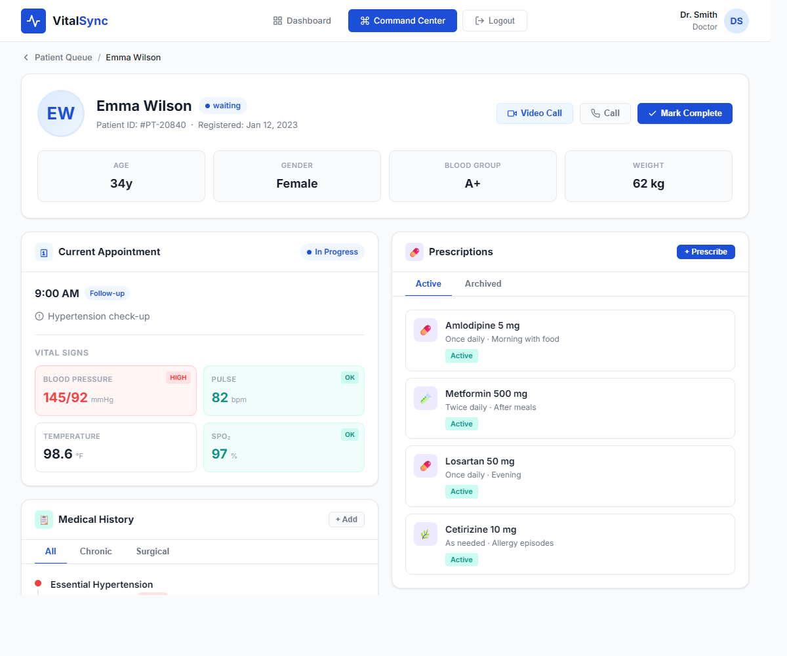
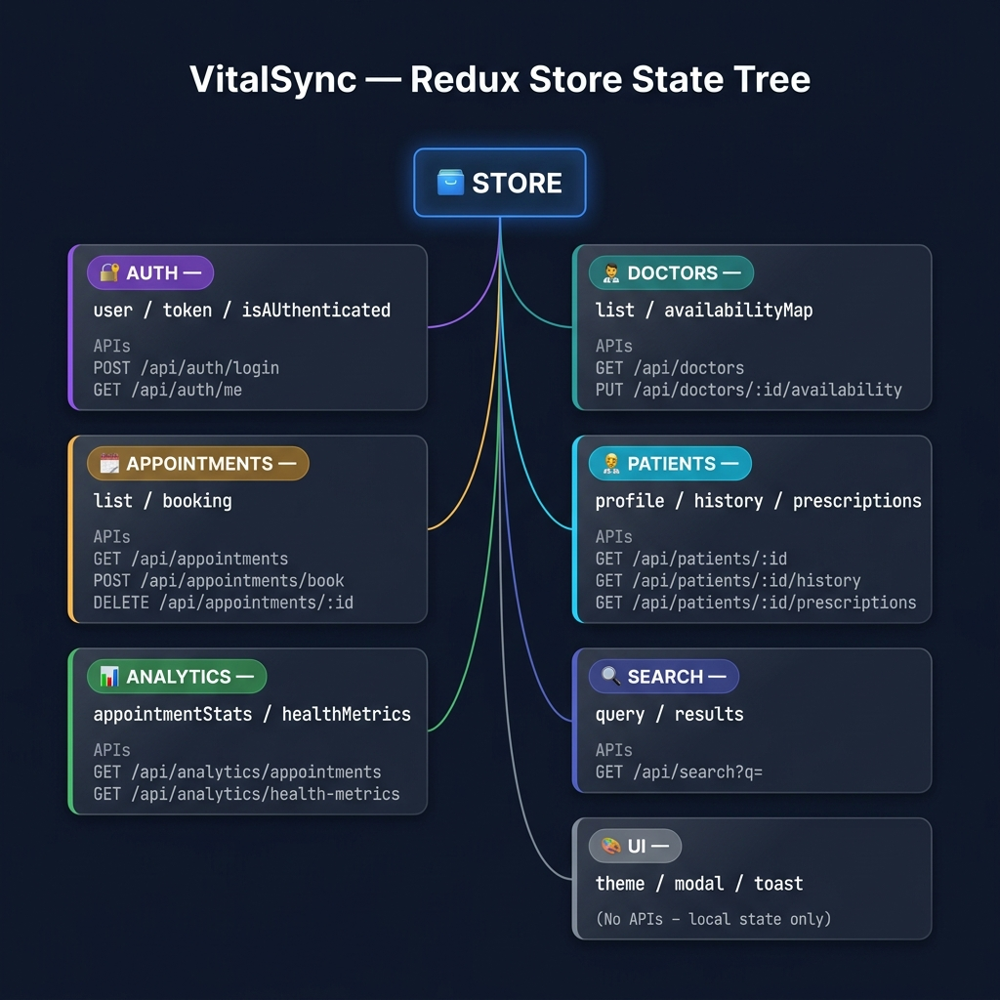

# VitalSync — Healthcare Patient Dashboard


---

## Overview

**VitalSync** is a modern hospital management dashboard designed to streamline healthcare delivery. It replaces fragmented legacy systems with a unified, role-based interface for patients and doctors — built with a focus on clean architecture, responsive design, and realistic data flows using mocked APIs.

This README serves as the complete **Product Requirements Document (PRD)** covering features, UI/UX designs, state management, and API strategy.

---

## Screen Designs

### Login Page
Role-based authentication for Patient, Doctor, and Admin. Includes a dark/light mode toggle and a Sign Up flow.

### Main Dashboard
Command center for patients (upcoming appointments, health metrics, charts) and doctors (patient queue, availability toggle).

### Patient Details Page
Data-rich view with a chronological medical history timeline, active prescriptions, and vital metrics.




---

## Core Features

### Patient Portal
- **Appointment Booking** — Browse available doctors, pick a time slot, confirm booking via mocked `POST /api/appointments/book`
- **Medical History Timeline** — Vertical timeline of past diagnoses and hospital visits
- **Prescriptions Viewer** — Active and archived prescriptions in tabbed view
- **Upcoming Appointments Widget** — Card list of next scheduled visits on the dashboard

### Doctor Dashboard
- **Availability Toggle** — On/off toggle updating doctor status via mocked `PUT /api/doctors/:id/availability`
- **Today's Patient Queue** — Scheduled patients list with appointment time and reason
- **Patient Detail Panel** — Side panel showing selected patient's history and prescriptions

### Global UI
- Role-based routing with protected routes
- Dark / Light mode toggle
- Fully responsive layout

---

## Advanced Features

### Health Analytics Chart Panel
Powered by [Recharts](https://recharts.org/). Renders two visualizations from locally seeded mock data:
- **Bar chart** — Appointment frequency by month (last 6 months)
- **Line chart** — Rolling health metric (e.g. blood pressure over time)

Chart data lives in the Redux store loaded from a mock JSON file — no backend required.

### Debounced Global Search
Search bar in the top nav queries across **doctors, appointments, and medical history** simultaneously, firing only after **300ms** of inactivity (`useDebounce` hook / `lodash.debounce`).

Results are grouped by category (Doctors / Appointments / History) in a floating dropdown — avoids excessive re-renders on every keystroke.

---

## State Management & API Design

Powered by **Redux Toolkit**. The store is split into 6 isolated slices, each owning its domain state and API calls.

### State Tree



```
STORE
│
├── AUTH          → user / token / isAuthenticated
│   └── POST /api/auth/login · GET /api/auth/me
│
├── DOCTORS       → list / availabilityMap
│   └── GET /api/doctors · PUT /api/doctors/:id/availability
│
├── APPOINTMENTS  → list / booking
│   └── GET /api/appointments · POST /api/appointments/book · DELETE /api/appointments/:id
│
├── PATIENTS      → profile / history / prescriptions
│   └── GET /api/patients/:id · GET /api/patients/:id/history · GET /api/patients/:id/prescriptions
│
├── ANALYTICS     → appointmentStats / healthMetrics
│   └── GET /api/analytics/appointments · GET /api/analytics/health-metrics
│
├── SEARCH        → query / results
│   └── GET /api/search?q=
│
└── UI            → theme / modal / toast  (local state, no API)
```

### Mock API Strategy
All endpoints are faked using **MSW (Mock Service Worker)** with seed data from local JSON files. No backend needed.

| Method | Endpoint | Description |
|--------|----------|-------------|
| `POST` | `/api/auth/login` | Authenticate user, return role + token |
| `GET` | `/api/doctors` | List all doctors with availability |
| `PUT` | `/api/doctors/:id/availability` | Toggle doctor availability |
| `GET` | `/api/patients/:id` | Get patient profile |
| `GET` | `/api/patients/:id/history` | Fetch medical history timeline |
| `GET` | `/api/patients/:id/prescriptions` | Fetch active & archived prescriptions |
| `GET` | `/api/appointments` | List upcoming appointments |
| `POST` | `/api/appointments/book` | Book appointment (returns `409` on conflict) |
| `DELETE` | `/api/appointments/:id` | Cancel appointment |
| `GET` | `/api/search?q=` | Global debounced search across all data |

---

## Technology Stack

| Category | Technology |
|----------|------------|
| Frontend | React.js / Next.js |
| Styling | Tailwind CSS + Vanilla CSS (Glassmorphism) |
| State Management | Redux Toolkit |
| Data Mocking | MSW (Mock Service Worker) |
| Charts | Recharts |
| Icons | Phosphor Icons |
| Typography | Inter (Google Fonts) |

---

## Future Enhancements

- WebRTC integration for Telehealth video consultations
- AI-powered symptom checker
- Push notifications for appointment reminders

---

> VitalSync — Syncing the pulse of modern healthcare.
